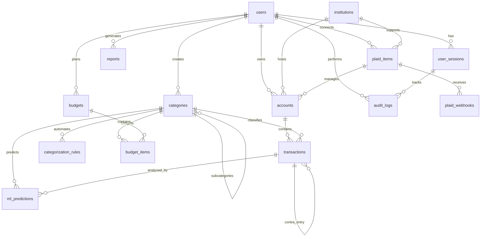

# Manna Financial Management Platform - Database Schema

## Overview

This document describes the comprehensive database schema for the Manna Financial Management Platform (Phase 1.2). The schema is designed for PostgreSQL using SQLAlchemy ORM and supports financial data integrity, audit trails, and double-entry bookkeeping principles.

## Architecture Principles

- **ACID Compliance**: All financial transactions maintain atomicity, consistency, isolation, and durability
- **Audit Trail**: Complete change tracking for compliance and debugging
- **Data Integrity**: Comprehensive constraints and validations
- **Performance**: Strategic indexing for common query patterns
- **Security**: Encrypted sensitive data and secure session management
- **Scalability**: Designed to handle growing transaction volumes

## Entity Relationship Diagram



## Core Tables

### 1. Users (`users`)

Central user account management with authentication and business profile data.

**Key Features:**

- UUID primary keys for security
- Business profile support (EIN, business type, address)
- Account security (failed attempts, lockout)
- Timezone and preferences support
- Password reset functionality

**Important Fields:**

- `email` (unique): Primary identifier
- `business_name`: For business users
- `tax_id`: EIN or SSN (encrypted)
- `preferences`: JSONB for user settings

### 2. Institutions (`institutions`)

Financial institutions from Plaid's database.

**Key Features:**

- Plaid institution mapping
- Branding information (logos, colors)
- OAuth requirement tracking
- Product availability

### 3. Accounts (`accounts`)

Linked financial accounts (bank, credit, investment).

**Key Features:**

- Multi-institution support
- Business/personal classification
- Real-time balance tracking
- Manual account support
- Sync status monitoring

**Important Constraints:**

- Account types: checking, savings, credit, investment, loan, other
- Unique account names per user
- Balance precision: 15,2 decimal places

### 4. Transactions (`transactions`)

Core financial transaction data with double-entry support.

**Key Features:**

- Double-entry bookkeeping support
- Precise decimal arithmetic (15,2 precision)
- Comprehensive categorization
- Location and payment method tracking
- Reconciliation status
- Tax year automatic assignment

**Important Fields:**

- `amount`: Always positive, sign determined by `transaction_type`
- `transaction_type`: 'debit' or 'credit'
- `contra_transaction_id`: For transfer entries
- `journal_entry_id`: Groups related entries
- `is_tax_deductible`: Tax reporting flag

**Performance Indexes:**

- account_id + date (chronological queries)
- merchant_name (categorization)
- category_id + date (reporting)
- business transactions by date

## Supporting Tables

### 5. Categories (`categories`)

Hierarchical category system for transaction classification.

**Key Features:**

- Parent-child relationships
- Business/personal classification
- Tax deductible marking
- System vs user categories
- Budget percentage suggestions

### 6. ML Predictions (`ml_predictions`)

Machine learning categorization results and feedback.

**Key Features:**

- Model versioning and tracking
- Confidence scoring (0.0000-1.0000)
- Alternative predictions storage
- User feedback collection
- Feature importance tracking

### 7. Categorization Rules (`categorization_rules`)

Automated transaction categorization rules.

**Key Features:**

- Multiple rule types (merchant, keyword, regex)
- Priority-based execution
- Accuracy tracking with user feedback
- Pattern matching with fuzzy support
- Business rule application

## Plaid Integration Tables

### 8. Plaid Items (`plaid_items`)

Plaid connection management for financial institutions.

**Key Features:**

- Access token storage (encrypted)
- Product availability tracking
- Sync cursor for incremental updates
- Error handling and reauth detection
- Consent expiration tracking

### 9. Plaid Webhooks (`plaid_webhooks`)

Real-time webhook event processing.

**Key Features:**

- Event deduplication with hashing
- Retry logic with exponential backoff
- Processing status tracking
- Transaction change counting
- Error handling and logging

## Financial Management Tables

### 10. Budgets (`budgets`) & Budget Items (`budget_items`)

Budget planning and tracking system.

**Budget Features:**

- Multiple budget types (monthly, quarterly, annual)
- Business/personal separation
- Template support for recurring budgets
- Alert threshold configuration

**Budget Item Features:**

- Category-based line items
- Fixed vs variable classification
- Essential vs discretionary marking
- Rollover support for unused budget
- Real-time variance tracking

### 11. Reports (`reports`)

Generated financial reports and owner packages.

**Key Features:**

- Multiple report types (P&L, Balance Sheet, Cash Flow)
- Version control and archiving
- Secure sharing with tokens
- Template-based generation
- Chart data storage for visualizations

## System Tables

### 12. Audit Logs (`audit_logs`)

Comprehensive audit trail for all system activities.

**Key Features:**

- Complete change tracking (old/new values)
- Business impact classification
- Compliance flagging
- Request correlation
- Security event detection

### 13. User Sessions (`user_sessions`)

Secure session management and tracking.

**Key Features:**

- Device fingerprinting
- Risk scoring and suspicious activity detection
- MFA requirement tracking
- Session type classification (web, mobile, API)
- Geographic location tracking

## Data Types and Constraints

### Financial Precision

- All monetary values use `Numeric(15, 2)` for exact decimal arithmetic
- Prevents floating-point precision errors in financial calculations
- Supports amounts up to $999,999,999,999.99

### UUID Usage

- All primary keys use UUID for security and distributed systems support
- Prevents enumeration attacks
- Enables sharding and replication

### JSONB Fields

- Preferences, metadata, and configuration stored as JSONB
- Indexed and queryable JSON data
- Flexible schema evolution

### Temporal Data

- All timestamps use `DateTime(timezone=True)` for UTC storage
- Automatic created_at/updated_at timestamps
- Proper timezone handling for global users

## Performance Considerations

### Strategic Indexing

```sql
-- High-frequency query patterns
CREATE INDEX idx_transactions_account_date ON transactions(account_id, date);
CREATE INDEX idx_transactions_business_date ON transactions(is_business, date);
CREATE INDEX idx_accounts_user_active ON accounts(user_id, is_active);
CREATE INDEX idx_ml_predictions_confidence ON ml_predictions(confidence);
```

### Query Optimization

- Composite indexes for common filter combinations
- Partial indexes on active records
- JSONB GIN indexes for metadata queries
- Strategic use of covering indexes

### Maintenance

- PostgreSQL VACUUM ANALYZE scheduling
- Index usage monitoring
- Query performance analysis
- Connection pooling configuration

## Security Measures

### Data Protection

- Sensitive fields marked for encryption at rest
- PII data minimization
- Secure password hashing (bcrypt)
- Session token security

### Access Control

- Row-level security policies (future enhancement)
- Audit trail for all data access
- Failed login attempt tracking
- Session risk scoring

### Compliance

- GDPR data handling support
- Financial regulations compliance
- Audit trail retention policies
- Data anonymization capabilities

## Migration Strategy

### Versioned Migrations

- Alembic for schema version control
- Forward and backward migration support
- Data migration scripts included
- Environment-specific configurations

### Development Workflow

```bash
# Initialize migration
alembic revision --autogenerate -m "description"

# Apply migrations
alembic upgrade head

# Rollback if needed
alembic downgrade -1
```

## Sample Queries

### Financial Reporting

```sql
-- Monthly P&L Summary
SELECT
    c.name AS category,
    SUM(CASE WHEN t.transaction_type = 'credit' THEN t.amount ELSE -t.amount END) AS net_amount
FROM transactions t
JOIN categories c ON t.category_id = c.id
WHERE t.is_business = true
    AND t.date >= '2024-01-01'
    AND t.date < '2024-02-01'
GROUP BY c.name
ORDER BY net_amount DESC;
```

### Budget vs Actual

```sql
-- Budget Performance Analysis
SELECT
    bi.name,
    bi.budgeted_amount,
    bi.actual_amount,
    (bi.actual_amount / bi.budgeted_amount * 100) AS utilization_pct
FROM budget_items bi
JOIN budgets b ON bi.budget_id = b.id
WHERE b.is_active = true
    AND b.user_id = $1;
```

### ML Model Performance

```sql
-- Categorization Accuracy
SELECT
    model_version,
    AVG(CASE WHEN is_accepted = true THEN 1.0 ELSE 0.0 END) AS accuracy_rate,
    COUNT(*) AS prediction_count
FROM ml_predictions
WHERE feedback_date IS NOT NULL
GROUP BY model_version
ORDER BY prediction_date DESC;
```

## Data Integrity Rules

### Financial Constraints

- Transaction amounts must be positive
- Account balances updated atomically
- Double-entry validation for transfers
- Tax year automatically set from transaction date

### Business Rules

- Users can only access their own data
- Categories inherit business classification
- Budget items must link to valid categories
- Plaid items require valid institutions

### Referential Integrity

- Foreign key constraints on all relationships
- Cascade deletes where appropriate
- Orphan record prevention
- Circular reference prevention in categories

## Future Enhancements

### Planned Features

- Multi-currency support with exchange rates
- Advanced reconciliation with bank statements
- Investment portfolio tracking
- Tax document generation
- API rate limiting and quotas
- Real-time notifications

### Scalability Improvements

- Read replicas for reporting queries
- Partitioning for large transaction tables
- Caching layer for frequent queries
- Archive strategy for historical data

This schema provides a solid foundation for the Manna Financial Management Platform, ensuring data integrity, performance, and scalability while supporting complex financial operations and reporting requirements.
